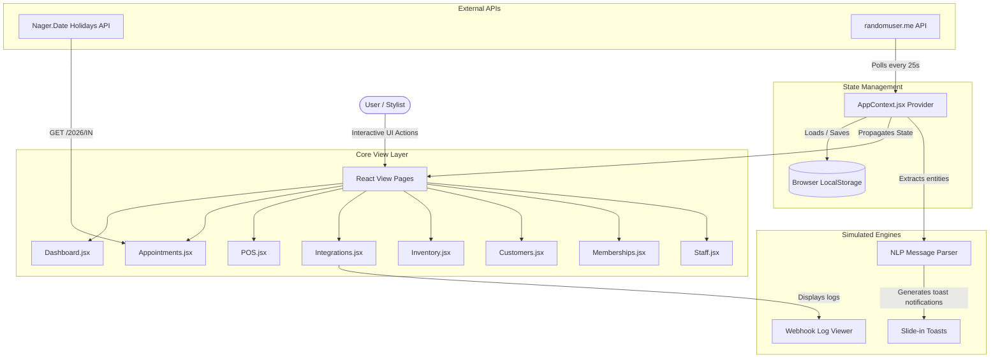

# 💇‍♀️ SalonSync — Enterprise Multi-Branch Salon Management Platform

[](https://react.dev/)
[](https://tailwindcss.com/)
[](https://vite.dev/)
[](https://reactrouter.com/)
[](https://recharts.org/)

**SalonSync** is a premium, client-first, multi-branch salon administration and marketing command center. Built to resolve scheduling conflicts, unify omnichannel client communications, compute staff split commissions, handle POS checkouts, manage inventory rosters, and offer loyalty and VIP memberships.

---

## 🎯 The Omnichannel Challenge & Problem Statement

Modern salon chains suffer from disconnected operations. Business owners and branch managers face:
1. **Omnichannel Booking Chaos** — Managing client bookings that arrive concurrently via website forms, simulated WhatsApp business chats, telephone calls, Instagram messages, and walk-in arrivals.
2. **Centralized Multi-Center Management** — Switching between distinct geographical branches (e.g., Delhi, Mumbai, Bangalore) and seeing immediate telemetry, rosters, active schedules, and product stock logs.
3. **Complex Roster & Commissions** — Calculating split stylist commissions (Senior Stylists vs. Assistants) dynamically on billing checkouts, which is prone to human error when tracked manually.
4. **Inventory & Loyalty Clashes** — Tracking stock counts with critical low-stock safety thresholds and implementing VIP tier discounts at checkout.

**SalonSync** solves these challenges by combining telemetry dashboards, real-world API integrations, real-time background webhook simulation, NLP client message parsing, and a POS register.

---

## 🛠️ System Architecture



---

## ✅ Core Functional Modules

### 📊 1. Multi-Branch Telemetry Dashboard
* **Dynamic KPIs**: Track today's revenue, booking totals, active staff availability ratios, and critical low-stock warnings.
* **Instant Branch Selection**: Switch between centers (e.g., Delhi, Bangalore, Mumbai) via the top header bar. All calendars, staff rosters, inventory ledgers, and revenue charts update instantly.
* **Reports & Analytics**: High-fidelity charts showing trailing 7-day revenue performance (AreaChart) and booking channel distributions (PieChart).
* **Welcome Desk Header**: Greets the logged-in administrator with a dynamic greeting card containing the localized session date context.
* **Source Code**: [Dashboard.jsx](file:///e:/SalonSync/src/pages/Dashboard.jsx)

### 📅 2. Stylist Column Calendar Scheduler
* **Column-by-Stylist Grid**: Tracks weekly bookings plotted vertically by time slots (09:00 to 20:00) and horizontally by active stylist.
* **Interactive Slots**: Double click on empty cells to pre-fill booking modals with stylist names and times.
* **Live Holidays API Sync**: Integrates with the free public **Nager.Date API** to query public holidays, warnings, and calendar details in real-time.
* **Source Code**: [Appointments.jsx](file:///e:/SalonSync/src/pages/Appointments.jsx)

### 💳 3. Smart POS Register & Invoicing
* **Service Selection Catalog**: Click hair, color, skin, nail, or makeup services to add them to the cart.
* **Auto Membership & Loyalty**: Auto-calculates 15% VIP member discounts and awards **10% spend loyalty points** on checkout.
* **Itemized Receipt Printing**: Generates beautiful tax invoices (with 18% GST calculation) ready for printing or digital receipts.
* **Source Code**: [POS.jsx](file:///e:/SalonSync/src/pages/POS.jsx)

### 💬 4. WhatsApp Webhook API Simulator
* **Real-time API Polling**: Connects to the free `randomuser.me` API to stream background client requests.
* **NLP Webhook Parser**: Automatically extracts parsed parameters (Client Name, Phone, Stylist, Service, Time) from incoming POST payloads.
* **Confirm Auto-Book**: Allows administrators to click "Confirm Auto-Book" to commit simulated bookings to the appointments book.
* **Source Code**: [Integrations.jsx](file:///e:/SalonSync/src/pages/Integrations.jsx)

### 🛍️ 5. Stock Inventory Controller
* **Live Alerts**: Visual warning banners and critical badges alert managers when product counts drop below safety thresholds.
* **Quick Roster Adjustments**: Add, edit, or adjust inventory quantities with one-click increment/decrement control counters.
* **Source Code**: [Inventory.jsx](file:///e:/SalonSync/src/pages/Inventory.jsx)

### 👥 6. Customer CRM Database & VIP Memberships
* **Customer Directory**: Track visitor transaction logs, check-ins, accumulated loyalty points, and preferred branch.
* **VIP Club Plan Membership Manager**: Enroll customers into tiers (e.g. Hair VIP, Nail Deluxe) to grant automated discount policies.
* **Source Code**: [Customers.jsx](file:///e:/SalonSync/src/pages/Customers.jsx) and [Memberships.jsx](file:///e:/SalonSync/src/pages/Memberships.jsx)

### 🌐 7. Customer Booking Portal
* **Brand Landing Page**: Aesthetic dark-themed landing page representing a high-end customer booking interface. Features hero banners, branch locator cards, curated service tab lists, and testimonials.
* **Interactive Booking Console**: Enables customers to book appointments directly online. Dynamically filters stylists based on the selected branch and category. Calculates base prices and tax (18% GST) on the fly.
* **Live Admin Linkage**: Saves reservations directly into the shared state database (marked with source `"website"`) which instantly updates admin analytics lists and fires real-time toast alerts on staff screens.
* **Source Code**: [Portal.jsx](file:///e:/SalonSync/src/pages/Portal.jsx)

---

## 🌐 Live External APIs & Webhooks

The project features two real-world API integrations:

1. **Nager.Date Public Holidays API** (`https://date.nager.at/api/v3/PublicHolidays/2026/IN`):
   * Queries real-world official public holidays in India for the active session year (2026).
   * Displays alert banners on the calendar page if the scheduled slot coincides with a national festival, advising administrators to check staffing levels.

2. **WhatsApp Webhook Polling Simulator via RandomUser API** (`https://randomuser.me/api/`):
   * Connects to a public web service every 25 seconds in the background (globally managed in [AppContext.jsx](file:///e:/SalonSync/src/context/AppContext.jsx)).
   * Extracts random user profiles to simulate live incoming WhatsApp webhook post notifications.
   * Feeds raw JSON payloads into an NLP-like engine that automatically maps message content to matching stylists, services, and appointment times.
   * Spawns slide-in toast notifications. Clicking a toast jumps directly to the integrations dashboard to review, modify, or confirm the booking request.

---

## 📁 Codebase Directory Structure

```text
SalonSync/
├── src/
│   ├── assets/             # Brand logos and assets
│   ├── components/         # Common Layout Elements
│   │   ├── Navbar.jsx      # Global navbar, notification log panel, branch summary
│   │   ├── Sidebar.jsx     # Modern sidebar navigation
│   │   └── BranchSelector.jsx # Branch picker context hook
│   ├── context/
│   │   └── AppContext.jsx  # Global state manager, API integrations, localStorage syncer
│   ├── data/
│   │   └── mockData.js     # Seeds for branches, inventory products, services, and staff
│   ├── pages/              # Primary functional application pages
│   │   ├── Dashboard.jsx
│   │   ├── Appointments.jsx
│   │   ├── POS.jsx
│   │   ├── Integrations.jsx
│   │   ├── Inventory.jsx
│   │   ├── Customers.jsx
│   │   ├── Memberships.jsx
│   │   ├── Staff.jsx
│   │   └── Portal.jsx
│   ├── App.css             # Component-level styles
│   ├── App.jsx             # React layout frame with slide-in toast manager
│   ├── index.css           # Core styling system (Scrollbars, animations, colors)
│   └── index.js            # React mounting hub
├── package.json            # Node project configuration
└── README.md               # User guide
```

---

## 🎨 Design System & Aesthetics

SalonSync is built with a refined, cohesive color palette and high-end interactive micro-animations:

* **Core Theme Mappings**:
  * 🔮 **Primary Accent (Purple)**: `#7c3aed` (`indigo-600` / `violet-600`)
  * 🌌 **Sidebar Navigation (Dark Mode)**: `#1a1a2e`
  * 🟢 **Success (Green)**: `#16a34a`
  * 🟠 **Warning (Orange)**: `#ea580c`
  * 🔴 **Error (Red)**: `#dc2626`
* **Micro-Animations & Smooth Transitions**:
  * Custom slide-in notifications from the bottom-right corner.
  * Elastic scale and opacity hover states on all interactive buttons.
  * Custom 6px ultra-thin scrollbars for standard containers to maximize content space and look clean.
* **Empty States**:
  * Fully implemented actionable empty states across all modules with relevant emojis and quick call-to-action buttons.

---

## ⚙️ Setup & Local Running

### 1. Prerequisites
Verify that you have [Node.js](https://nodejs.org/) installed (version 18+ is recommended).

### 2. Installation
Install the required packages in the root directory:
```bash
npm install
```

### 3. Start Development Server
Launch the local Vite server:
```bash
npm start
```
The application will boot at [http://localhost:5173](http://localhost:5173) in your browser.

### 4. Build for Production
To package the application into static HTML/CSS/JS assets inside the `dist` directory:
```bash
npm run build
```

---

## 👨‍💻 Built For
**SummerShip Challenge 2026** — GradSkills × CodeQuesters
