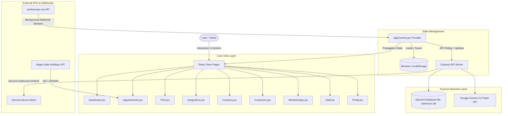
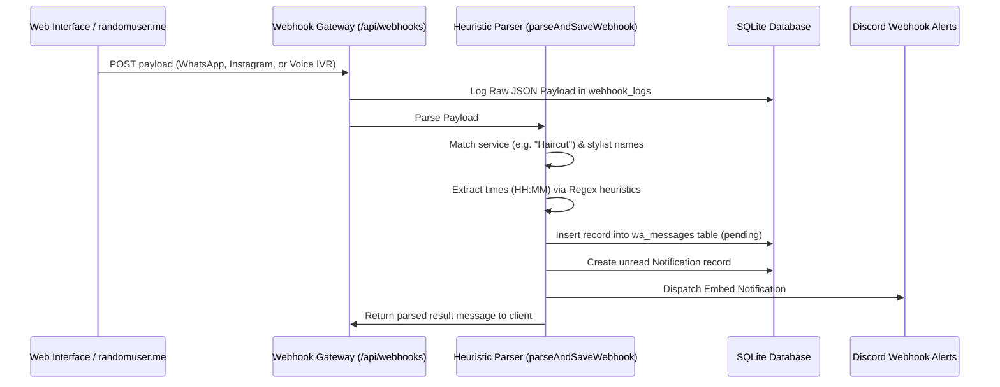
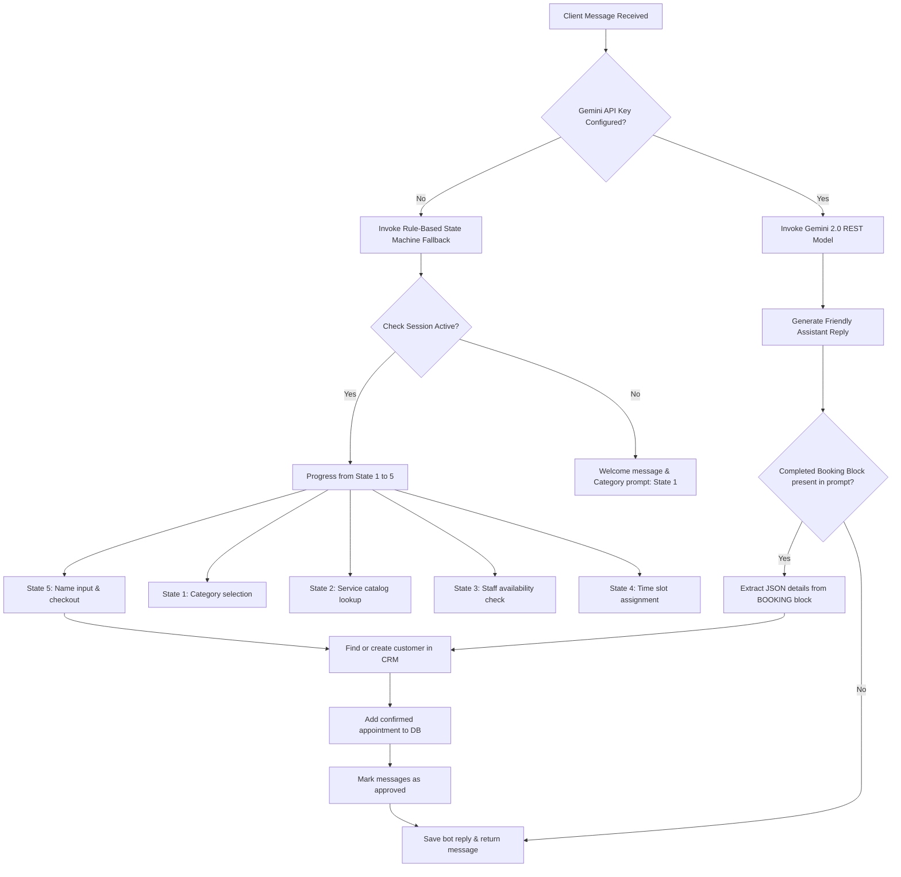
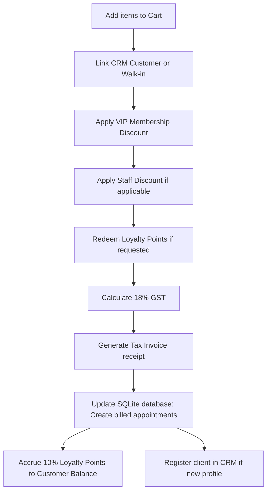

# 💇‍♀️ SalonSync — Enterprise Multi-Branch Salon Management Platform

[](https://react.dev/)
[](https://tailwindcss.com/)
[](https://vite.dev/)
[](https://expressjs.com/)
[](https://www.sqlite.org/)

**SalonSync** is a premium, client-first, multi-branch salon administration, billing (POS), and omnichannel marketing command center. Built to resolve concurrent scheduling conflicts, unify omnichannel client communications (WhatsApp, Instagram, Voice IVR), compute staff split commissions, handle POS checkouts, manage inventory rosters, and offer loyalty and VIP memberships.

---

## 🎯 The Omnichannel Challenge & Problem Statement

Modern salon chains face operational challenges due to fragmented systems. Business owners and branch managers deal with:
1. **Omnichannel Booking Chaos** — Managing client bookings that arrive concurrently via website reservation forms, simulated WhatsApp business chats, telephone IVR calls, Instagram DMs, and walk-in arrivals.
2. **Centralized Multi-Center Management** — Switching between distinct geographical branches (e.g., Banjara Hills, Jubilee Hills, Gachibowli) and seeing immediate telemetry, rosters, active schedules, and product stock logs.
3. **Complex Roster & Commissions** — Calculating split stylist commissions (based on role and commission percentage) dynamically on billing checkouts, which is prone to human error when tracked manually.
4. **Inventory & Loyalty Clashes** — Tracking stock counts with critical low-stock safety thresholds and implementing VIP tier discounts at checkout.

**SalonSync** solves these challenges by combining real-world API integrations, a background webhook simulation engine, NLP client message parsing, a conversational AI booking assistant, and a POS register.

---

## 🛠️ System Architecture



---

## 📁 Repository Layout & Source Code Map

```text
SalonSync/
├── public/                 # Static public assets
├── server/                 # Express backend directory
│   ├── clean_messages.js   # Script to purge simulated conversation records
│   ├── db.js               # SQLite table configurations, seeding, and connection hub
│   ├── gemini-chatbot.js   # Gemini 2.0 Flash prompt structure & REST client
│   ├── index.js            # Main server entry, Express routes, and webhook receiver
│   ├── salonsync.db        # SQLite database binary
│   └── seed_last_five_days.js # Script to seed historical data for telemetry metrics
├── src/                    # Frontend source root
│   ├── assets/             # Brand logos and styling assets
│   ├── components/         # Layout & Common Elements
│   │   ├── BranchSelector.jsx # Branch selector dropdown context hook
│   │   ├── DateSelector.jsx   # Header panel for session date context
│   │   ├── Navbar.jsx      # Global navigation header & notifications panel
│   │   └── Sidebar.jsx     # Navigation sidebar sidebar
│   ├── context/
│   │   └── AppContext.jsx  # Global state manager, API integrations, and polling
│   ├── data/
│   │   └── mockData.js     # Seeds for initial branches, services, staff, and products
│   ├── pages/              # Primary functional application pages
│   │   ├── Appointments.jsx # Stylist column calendar scheduler
│   │   ├── Customers.jsx   # CRM database & profile ledger
│   │   ├── Dashboard.jsx   # Multi-branch telemetry dashboard
│   │   ├── Integrations.jsx # Omnichannel inbox & webhook gateway settings
│   │   ├── Inventory.jsx    # Stock controller & warning ledger
│   │   ├── Memberships.jsx  # VIP plans catalog & subscription model
│   │   ├── POS.jsx         # Point of Sale checkouts & invoice generator
│   │   ├── Portal.jsx      # Customer-facing reservation booking landing page
│   │   └── Staff.jsx       # Stylist roster commissions manager
│   ├── App.css             # Component-level styles
│   ├── App.jsx             # React routing frame & toast notifications container
│   ├── index.css           # Core styling system (Scrollbars, animations, colors)
│   └── index.js            # React mounting hub
├── index.html              # HTML shell & JIT Tailwind configuration block
├── package.json            # Node project configuration
└── README.md               # System guide (This file)
```

---

## 🗄️ SQLite Database Schema & Data Models

SalonSync stores data locally in a SQLite3 database (`server/salonsync.db`). The schema consists of 10 tables initialized and seeded automatically in [db.js](file:///e:/SalonSync/server/db.js):

### 1. `branches`
Stores geographical salon locations.
```sql
CREATE TABLE branches (
  id INTEGER PRIMARY KEY,
  name TEXT NOT NULL,
  city TEXT NOT NULL
);
```

### 2. `services`
Stores service offerings catalog with standard rate and duration.
```sql
CREATE TABLE services (
  id INTEGER PRIMARY KEY,
  name TEXT NOT NULL,
  price REAL NOT NULL,
  duration INTEGER NOT NULL,
  category TEXT NOT NULL
);
```

### 3. `staff`
Stores information about salon stylists, roles, and branch associations.
```sql
CREATE TABLE staff (
  id INTEGER PRIMARY KEY,
  name TEXT NOT NULL,
  role TEXT NOT NULL,
  branchId INTEGER NOT NULL,
  commissionPct INTEGER NOT NULL, -- Commission split percentage (e.g. 20%)
  phone TEXT NOT NULL
);
```

### 4. `customers`
Stores customer records, accumulated loyalty points, check-ins, and membership links.
```sql
CREATE TABLE customers (
  id INTEGER PRIMARY KEY AUTOINCREMENT,
  name TEXT NOT NULL,
  phone TEXT NOT NULL UNIQUE,
  email TEXT,
  loyaltyPoints INTEGER DEFAULT 0,
  totalVisits INTEGER DEFAULT 0,
  preferredBranch INTEGER NOT NULL,
  membershipId INTEGER
);
```

### 5. `appointments`
Stores appointments with status, billing details, and source channels.
```sql
CREATE TABLE appointments (
  id INTEGER PRIMARY KEY AUTOINCREMENT,
  customerId INTEGER NOT NULL,
  customerName TEXT NOT NULL,
  staffId INTEGER NOT NULL,
  staffName TEXT NOT NULL,
  serviceId INTEGER NOT NULL,
  serviceName TEXT NOT NULL,
  branchId INTEGER NOT NULL,
  date TEXT NOT NULL,
  time TEXT NOT NULL,
  status TEXT NOT NULL, -- pending | confirmed | inprogress | completed | billed | cancelled
  source TEXT NOT NULL, -- walkin | website | whatsapp | instagram | call
  amount REAL NOT NULL  -- Final transaction billing amount
);
```

### 6. `inventory`
Stores product inventory counts, categories, and branch-specific locations.
```sql
CREATE TABLE inventory (
  id INTEGER PRIMARY KEY AUTOINCREMENT,
  name TEXT NOT NULL,
  category TEXT NOT NULL,
  branchId INTEGER NOT NULL,
  quantity INTEGER NOT NULL,
  minStock INTEGER NOT NULL, -- Safety threshold
  unit TEXT NOT NULL,        -- tubes | bottles | kits | packs
  price REAL NOT NULL
);
```

### 7. `wa_messages`
Stores simulated inbound/outbound communication logs.
```sql
CREATE TABLE wa_messages (
  id TEXT PRIMARY KEY,
  sender TEXT NOT NULL,  -- client | system
  text TEXT NOT NULL,
  time TEXT NOT NULL,
  channel TEXT NOT NULL, -- whatsapp | instagram | voice
  status TEXT NOT NULL,  -- pending | approved | dispatched
  clientName TEXT,
  phone TEXT,
  service TEXT,          -- JSON string mapping service metadata
  stylist TEXT,          -- JSON string mapping stylist metadata
  date TEXT,
  timeSlot TEXT,
  branchId INTEGER
);
```

### 8. `notifications`
Stores system alerts and logs.
```sql
CREATE TABLE notifications (
  id TEXT PRIMARY KEY,
  customerName TEXT NOT NULL,
  phone TEXT NOT NULL,
  message TEXT NOT NULL,
  type TEXT NOT NULL,      -- WhatsApp | Instagram | SMS | Voice Call
  timestamp TEXT NOT NULL,
  status TEXT NOT NULL,
  unread INTEGER DEFAULT 1 -- Boolean representation (1 = True, 0 = False)
);
```

### 9. `webhook_logs`
Stores raw incoming POST JSON payloads.
```sql
CREATE TABLE webhook_logs (
  id INTEGER PRIMARY KEY AUTOINCREMENT,
  payload TEXT NOT NULL,
  timestamp DATETIME DEFAULT CURRENT_TIMESTAMP
);
```

### 10. `settings`
Stores persistent settings like tokens, keys, and custom colors.
```sql
CREATE TABLE settings (
  key TEXT PRIMARY KEY,
  value TEXT
);
```

---

## 💬 Omnichannel Webhook Gateway & NLP Sim

The webhook simulator enables multi-channel testing without active external phone lines:



### Webhook Verification & Real APIs
The server exposes Meta verify token endpoints to allow production mapping:
- **GET** `/api/webhooks/whatsapp`
- **GET** `/api/webhooks/instagram`

If Meta webhook challenge requests match the value of `whatsapp_verify_token` in `settings`, the backend returns the `hub.challenge` string, satisfying verification requirements.

### Background Polling
In [AppContext.jsx](file:///e:/SalonSync/src/context/AppContext.jsx), if `isLiveStreaming` is active:
- It polls `https://randomuser.me/api/` every 25 seconds.
- It randomly chooses a channel (`whatsapp`, `instagram`, or `voice`) and maps the generated profiles to simulated customer requests.
- It sends a POST to `/api/webhooks/<channel>` to test the full parsing and integration path.

---

## 🤖 AI Booking Assistant & State Machine Fallback

The chatbot flows are processed in the backend. When a POST arrives at `/api/ai/chat`:
- The client message is saved as `client` message in `wa_messages`.
- The system checks if `gemini_api_key` is configured:



---

## 💳 Point of Sale (POS) & Billing System

The POS register allows cashiers to check out clients, enroll them in memberships, redeem points, and print tax receipts.



### Billing Formulas

#### 1. VIP Membership Discount
If the customer is subscribed to a VIP membership plan matching the category:
$$\text{VIP Discount} = \sum (\text{Item Price} \times \text{Quantity} \times \text{Plan Discount Pct})$$

#### 2. Subtotal & Taxable Amount
$$\text{Taxable Amount} = \text{Subtotal} - \text{Promo Discount} - \text{VIP Discount}$$
$$\text{CGST (9\%)} = \text{Taxable Amount} \times 0.09$$
$$\text{SGST (9\%)} = \text{Taxable Amount} \times 0.09$$
$$\text{GST Amount} = \text{CGST} + \text{SGST} = \text{Taxable Amount} \times 0.18$$

#### 3. Loyalty Redemption
If `redeemPoints` is active, the discount is calculated at a rate of 10 points = ₹1:
$$\text{Loyalty Discount Amount} = \text{Redeemed Points} \times 0.10$$
$$\text{Grand Total} = (\text{Taxable Amount} + \text{GST Amount}) - \text{Loyalty Discount Amount}$$

#### 4. Loyalty Points Accrual
Upon payment checkouts, the system automatically awards the customer **10% of the paid grand total** in loyalty points:
$$\text{Points Earned} = \text{Round}(\text{Grand Total} \times 0.10)$$

#### 5. Staff Commission Split
Each service in the cart checked out generates a commission split calculated directly from the invoice total using the assigned stylist's commission rate:
$$\text{Stylist Commission} = \text{Billed Item Total} \times \left( \frac{\text{Stylist Commission Pct}}{100} \right)$$

---

## 📅 Visual Roster Calendar & Public Holidays API

The Calendar page ([Appointments.jsx](file:///e:/SalonSync/src/pages/Appointments.jsx)) plots active stylist schedules dynamically:

* **Stylist Columns**: Appointments are organized in vertical columns for each stylist, with timeslots from 09:00 to 20:00.
* **Double Booking Check**: Prevents overlapping appointments for the same stylist:
  $$\text{Overlap} = (T_{1\text{Start}} < T_{2\text{End}}) \land (T_{2\text{Start}} < T_{1\text{End}})$$
* **Nager.Date Public Holidays Integration**:
  - The calendar page fetches national holidays for India: `https://date.nager.at/api/v3/PublicHolidays/2026/IN`.
  - The fetch utility uses a nested try-catch block to handle network intercept failures:
    ```javascript
    try {
      const res = await fetch('https://date.nager.at/api/v3/PublicHolidays/2026/IN');
      if (res.ok) {
        const text = await res.text();
        if (text && text.trim()) {
          const data = JSON.parse(text);
          setHolidays(data);
        }
      }
    } catch (e) {
      console.warn("Could not load live holiday database:", e.message);
    }
    ```
  - If an appointment overlaps with a holiday, a banner warns the manager to check staff scheduling.

---

## ⚙️ Setup & Local Running

### 1. Prerequisites
Verify that you have [Node.js](https://nodejs.org/) installed (version 18+ is recommended).

### 2. Installation
Install root dependencies and start development servers:

```bash
# 1. Install root dependencies
npm install

# 2. Start the Vite React development server
# Runs at http://localhost:5173
npm start
```

For the backend server:
```bash
# 3. Navigate to server folder and install dependencies
cd server
npm install

# 4. Start the Express server
# Runs at http://localhost:5000
npm start
```

### 3. Activating integrations

#### A. Gemini AI Assistant
1. Open the SalonSync panel.
2. Go to **Integration Settings** -> **AI Configuration**.
3. Paste your Google Gemini API Key and save. The chatbot simulator will transition from the fallback state machine to the Gemini model.

#### B. Discord Webhook Alerts
1. Open your Discord server settings and create a Webhook integration.
2. Paste the URL into **Integration Settings** -> **Alerts & Discord Configuration**.
3. Click **Test Webhook Link** to send a test message.
